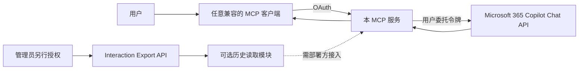

# Microsoft 365 Copilot MCP

这个独立 MCP 服务通过 Microsoft Graph 的 Microsoft 365 Copilot Chat API 提供问答能力。兼容 Streamable HTTP MCP 与 OAuth 的客户端可以让用户用自己的组织账号连接，在客户端中向 Copilot 提问、追问，并按需附上用户选定的文字背景。服务不依赖特定的 Agent 平台或客户端品牌。

历史会话读取使用另一套管理员授权。本仓库提供读取模块，但默认服务**没有启用历史工具**；仅部署这个 MCP 服务不会自动获得旧聊天、Pages、Notebooks 或 Copilot Studio Agent 的内容。



## 能力与边界

| 能力 | 本仓库状态 | 关键边界 |
| --- | --- | --- |
| Copilot 问答与同一 API 会话内追问 | 已接入 MCP 服务 | Chat API 使用 `/beta`，微软标注不支持用于生产应用；用户需有 Microsoft 365 Copilot 附加许可 |
| 用户选定的文字背景 | 已接入 MCP 服务 | 只保存本进程内的快照，不自动抓取文件或旧聊天 |
| 旧 Copilot 会话原文 | 独立读取模块 | 需要管理员授权与部署方接线；默认 MCP 服务未启用 |
| 指定 Copilot Studio Agent、Pages / Notebooks 结构化导出、Cowork 续跑 | 未实现 | 普通 Chat API 不提供这些能力 |

微软目前要求 Chat API 使用七项 Graph 委托权限；对持有 Microsoft 365 Copilot 附加许可的用户，微软说明该 API 无额外费用。客户端模型、基础许可与部署仍可能产生费用。历史导出需要单独的 `AiEnterpriseInteraction.Read.All` 应用权限，范围由微软侧授权决定。详见[接口与边界](docs/architecture.md)。

默认 MCP 服务提供五个工具：`microsoft_connection_status` 查询连接状态，`microsoft_capability_status` 查看可用范围，`microsoft_ask_copilot` 提问或追问，`microsoft_import_context` 保存用户选定的文字背景，`microsoft_list_contexts` 列出已保存的背景。背景和会话都只存在本进程内存中。

## 启动

需要 Node.js 22+、组织租户中的 Entra 应用注册、用户的 Microsoft 365 Copilot 附加许可，以及组织核准的 Chat API 委托权限。使用前阅读 [Microsoft 预览条款](https://learn.microsoft.com/en-us/legal/m365-copilot-apis/terms-of-use)。

```powershell
npm ci
Copy-Item .env.example .env
# 编辑 .env：填入自己的租户、应用、允许账号、MCP 客户端回调及服务截止时间
node --env-file=.env src/server.mjs
```

Entra 应用的本机登录回调是 `http://localhost:8788`；MCP 客户端的 OAuth 回调是另一条地址，必须精确列入 `M365_MCP_REDIRECT_URIS`。客户端回调可以是 HTTPS，或仅限本机的 HTTP 回环地址。还须配置用户的 IANA 时区 `M365_MCP_TIME_ZONE`。服务默认监听 `127.0.0.1:8787`，MCP 地址为 `http://127.0.0.1:8787/mcp`。完整配置与首次验收见[开发者接入指南](docs/developer-setup.md)。远端客户端需要受控的 HTTPS 入口；不要将本地服务直接暴露在公网。

运行 `npm test` 可离线检查 OAuth / MCP 契约、会话隔离、调用上限及历史分页与筛选；测试不调用微软。

## 代码与文档

- `src/server.mjs`、`src/oauth.mjs`：本地 MCP 端点、OAuth / PKCE、令牌与连接绑定。
- `src/microsoft.mjs`：Copilot Chat API 问答、追问和用户选定背景。
- `src/interaction-history.mjs`：需管理员授权后由部署方接入的历史会话读取模块。
- [`docs/architecture.md`](docs/architecture.md)：两套权限、数据流、成本与接口边界。
- [`docs/developer-setup.md`](docs/developer-setup.md)：从空白租户应用到首轮 MCP 问答的配置与验收。

本仓库没有附带公开使用许可；公开可读不等于授予复制、修改或再分发权利。微软、Copilot、Microsoft 365 及相关商标属于各自权利人。
