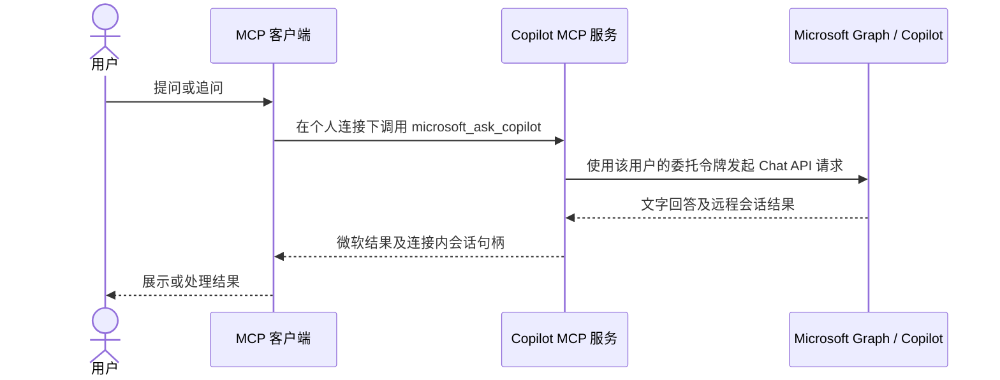

# 接口与技术边界

本服务使用 Microsoft Graph 的两种不同接口。普通对话已经接入 MCP；历史导出只提供独立模块，需要部署方另行授权并接入。

## 两条不同的连接路径

| 路径 | 身份与权限 | 能得到什么 | 本仓库处理 |
| --- | --- | --- | --- |
| 普通 Copilot 对话 | 用户本人登录；Chat API 要求七项 Graph 委托读取权限 | 发起新 API 会话、获得文字回答、使用返回的会话 ID 追问 | MCP 服务已接线；远程会话 ID 只在个人连接内保存 |
| 历史交互导出 | 企业应用权限 `AiEnterpriseInteraction.Read.All`，需管理员同意 | 在许可与覆盖范围内导出 Copilot 提问、回答及相关记录 | 提供限定用户、时间窗和会话 ID 的读取模块；证书/令牌和服务器接线由部署方实现 |

个人 OAuth 成功**不会**自动获得历史导出权限；历史导出权限也**不能**替代普通 Chat 的用户身份。历史接口的应用权限由微软授予给应用，本地会话白名单只是第二道限制，不能从根本上缩小应用在微软侧的授权范围。

`microsoft_import_context` 保存用户明确提供的文字快照；它不从 Microsoft 自动读取文件或聊天。Chat API 新生成的回答不等于旧聊天原文。旧聊天需通过独立的 Interaction Export 路线获取，并记录时间、来源与覆盖范围。微软说明该历史接口不返回 Copilot Studio 创建的 Agent 的交互；Copilot Studio Agent 配置、Notebook 结构与 Cowork 任务状态也不由本服务导出。

需要历史读取的部署方可调用 `createInteractionHistoryReader()`，传入已核准的 `tenantId`、目标 `userId`、同一用户绑定、时间窗、允许的会话 ID 和 `getToken()`。读取器检查分页来源、请求上限与返回记录，并只向调用方返回所选会话。部署方须自行实现应用凭据保护、管理员同意、权限撤销以及与 MCP 服务的接线；默认启动入口没有启用历史读取。不要把个人 Chat 令牌传给历史接口。

## 当前代码的部署约束

服务仅监听本机回环地址，令牌、会话和背景都存在进程内存中，进程重启后须重新连接。它绑定一个明确允许的微软账号，限制回调、会话句柄、请求次数和服务截止时间；没有数据库、跨进程共享、审计留存、租户级管理、外网入口或多用户隔离实现。`src/interaction-history.mjs` 只接受部署方传入的 `getToken()`，不会自行寻找证书、读取操作系统凭据或申请管理员权限。

若要供多个用户或租户使用，需要补齐授权与撤销、持久凭据保护、隔离、审计、错误恢复和费用归因，并重新核对预览接口的商用条款。远端 MCP 客户端还需要受控 HTTPS 入口；不要直接暴露本机服务。

## 费用与许可

微软官方说明：Chat API 预览版面向持有 Microsoft 365 Copilot 附加许可的用户，当前无额外 Chat API 费用；不持有该许可的用户目前不能使用该 API。这并不免除 Microsoft 365 基础许可、MCP 客户端自身模型和部署成本。本服务没有接入 Work IQ 的按量计费路线，也不在调用失败时自动改走付费接口。历史导出的适用许可及管理员权限须按租户和最新条款核对。

## 官方资料

- [Microsoft 365 Copilot Chat API 概览与许可](https://learn.microsoft.com/en-us/microsoft-365/copilot/extensibility/api/ai-services/chat/overview)
- [创建 Copilot 会话所需权限](https://learn.microsoft.com/en-us/microsoft-365/copilot/extensibility/api/ai-services/chat/copilotroot-post-conversations)
- [Interaction Export API](https://learn.microsoft.com/en-us/graph/api/aiInteractionHistory-getAllEnterpriseInteractions)
- [Microsoft 365 Copilot APIs 预览条款](https://learn.microsoft.com/en-us/legal/m365-copilot-apis/terms-of-use)
