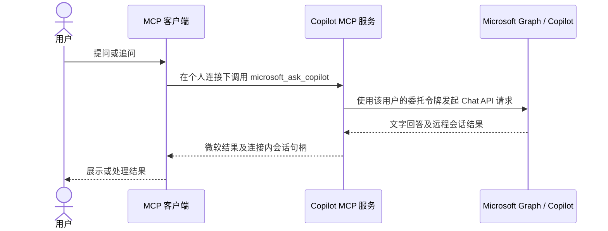

# 接口与技术边界

本服务通过一个 MCP 入口提供 Copilot 问答，并可按需启用历史会话读取。两项能力使用不同的 Microsoft Graph 接口和权限，但不是两套 MCP 代码或两次客户端连接。

## 同一连接中的两项能力

| 路径 | 身份与权限 | 能得到什么 | 本仓库处理 |
| --- | --- | --- | --- |
| Copilot 对话 | 用户本人登录；Chat API 要求七项 Graph 委托读取权限 | 发起新 API 会话、获得文字回答、使用返回的会话 ID 追问 | 默认启用；远程会话 ID 只在个人连接内保存 |
| 过去的 Copilot 会话 | 同一 Entra 应用另需 `AiEnterpriseInteraction.Read.All` 应用权限、管理员同意及证书 | 在微软记录的范围内按用户与日期读取提问、回答，并从返回数据发现会话 ID | 配置 `M365_MCP_HISTORY_ENABLED=true` 后在同一 MCP 服务显示两个历史工具；默认关闭 |

个人 OAuth 成功**不会**自动获得历史读取权限；管理员同意历史读取，也**不能**替代普通 Chat 的用户身份。微软授予的应用权限覆盖租户，本服务将查询绑定到当前允许登录的账号；这个本地限制不会改变微软侧权限的广度。

`microsoft_import_context` 保存用户明确提供的文字快照；它不从 Microsoft 自动读取文件或聊天。Chat API 新生成的回答不等于旧聊天原文。启用历史工具后，`microsoft_list_copilot_history` 在配置的时间范围内读取该用户的交互并从微软返回结果提取会话 ID；`microsoft_read_copilot_history` 按 ID 分页读取提问和回答，默认输出便于阅读的文字，可选输出微软返回的原始记录。单次输出超过 2 MiB 时会明确报错，需缩小消息页或关闭原始记录输出。无需先手工找出会话 ID。微软说明该历史接口不返回 Copilot Studio 创建的 Agent 的交互；Copilot Studio Agent 配置、Notebook 结构与 Cowork 任务状态也不由本服务导出。

需要历史读取时，在同一 Entra 应用中添加应用权限、由管理员同意，并上传证书；服务使用部署方配置的私钥取得应用令牌。读取器绑定登录用户，允许每次查询在配置的总日期范围内进一步缩小；还核对分页来源、限制单次四页与全进程请求总数。可选的会话 ID 白名单仍供开发者收窄结果，但默认会从微软返回数据中发现会话；微软 API 本身也不要求预先知道会话 ID。范围过大时返回明确错误，用户可缩小日期重试；服务不会将未读完的列表标为完整。文字查找在已取回的记录中本地进行，微软接口没有提供这里使用的全文搜索参数。不要把个人 Chat 令牌传给历史接口。[微软接口说明](https://learn.microsoft.com/en-us/microsoft-365/copilot/extensibility/api/ai-services/interaction-export/aiinteractionhistory-getallenterpriseinteractions)给出了按用户取全部交互的请求示例、日期筛选和返回的 `sessionId`。

## 当前代码的部署约束

服务仅监听本机回环地址，令牌、会话和背景都存在进程内存中，进程重启后须重新连接。它绑定一个明确允许的微软账号，限制回调、会话句柄、请求次数和服务截止时间；没有数据库、跨进程共享、审计留存、租户级管理、外网入口或多用户隔离实现。历史功能开启时会读取配置的本地私钥文件并申请应用令牌；它不会在微软租户中自行添加权限或替管理员同意。

若要供多个用户或租户使用，需要补齐授权与撤销、持久凭据保护、隔离、审计、错误恢复和费用归因，并重新核对预览接口的商用条款。远端 MCP 客户端还需要受控 HTTPS 入口；不要直接暴露本机服务。

## 费用与许可

微软官方说明：Chat API 预览版面向持有 Microsoft 365 Copilot 附加许可的用户，当前无额外 Chat API 费用；不持有该许可的用户目前不能使用该 API。这并不免除 Microsoft 365 基础许可、MCP 客户端自身模型和部署成本。本服务没有接入 Work IQ 的按量计费路线，也不在调用失败时自动改走付费接口。历史接口要求有效的 Microsoft 365 Copilot 许可及相应服务计划；实际覆盖范围因租户许可和体验而异。

## 官方资料

- [Microsoft 365 Copilot Chat API 概览与许可](https://learn.microsoft.com/en-us/microsoft-365/copilot/extensibility/api/ai-services/chat/overview)
- [创建 Copilot 会话所需权限](https://learn.microsoft.com/en-us/microsoft-365/copilot/extensibility/api/ai-services/chat/copilotroot-post-conversations)
- [Interaction Export API](https://learn.microsoft.com/en-us/microsoft-365/copilot/extensibility/api/ai-services/interaction-export/aiinteractionhistory-getallenterpriseinteractions)
- [在 Microsoft Entra 配置应用权限和管理员同意](https://learn.microsoft.com/en-us/entra/identity-platform/quickstart-configure-app-access-web-apis)
- [MSAL Node 使用证书凭据](https://learn.microsoft.com/en-us/entra/msal/javascript/node/certificate-credentials)
- [Microsoft 365 Copilot APIs 预览条款](https://learn.microsoft.com/en-us/legal/m365-copilot-apis/terms-of-use)
